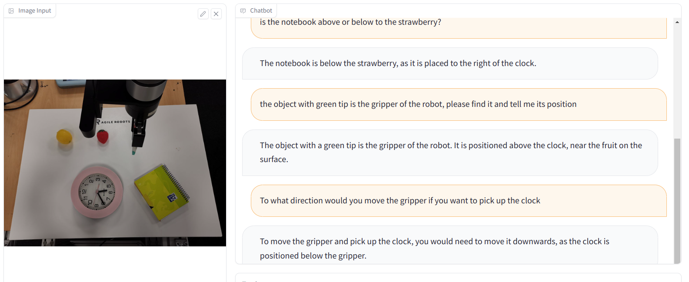
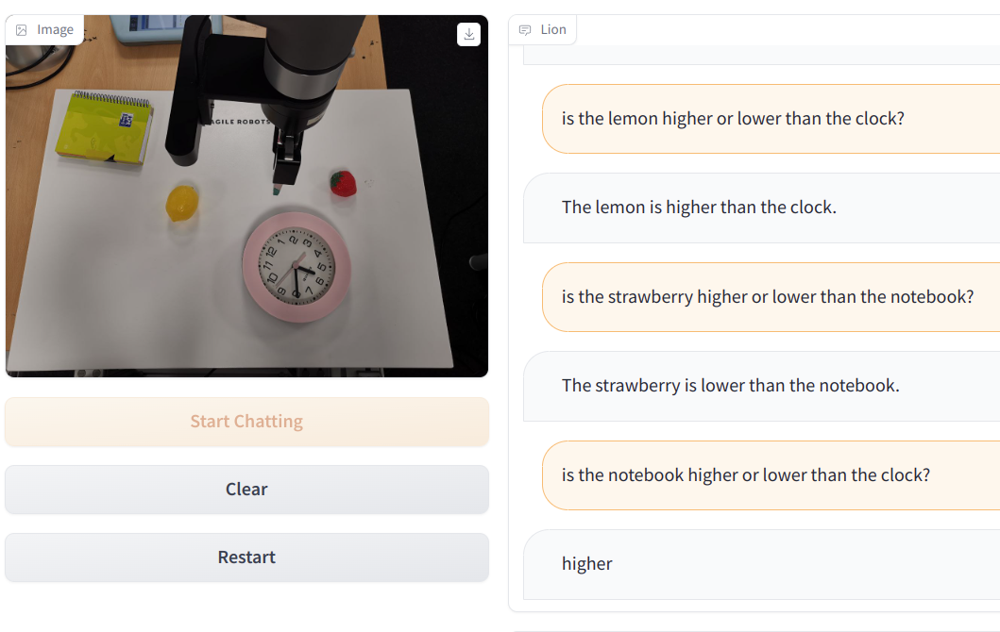

# 多模态大模型榜单

# ChatGPT
[chatgpt](./summary.md)

# 文心一言
不具备空间感知

# 通义千问
不具备空间感知

---
# 多模态大模型榜单

https://github.com/BradyFU/Awesome-Multimodal-Large-Language-Models/tree/Evaluation

下面是榜单上位置感知能力最强的两个模型

## SPHINX-MLLM Demo
有明显强于ChatGPT4v的空间感知能力

http://imagebind-llm.opengvlab.com/

## Lion
有明显强于ChatGPT4v的空间感知能力

https://7be2e9332ce332c5cc.gradio.live/
